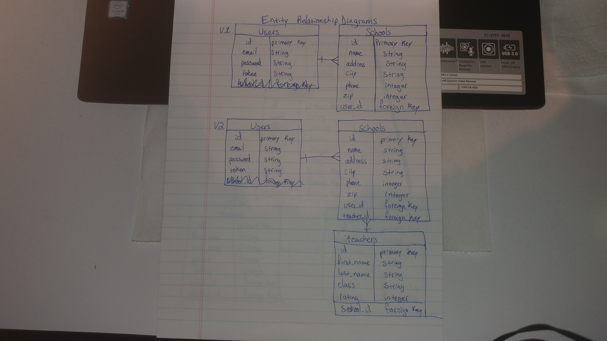
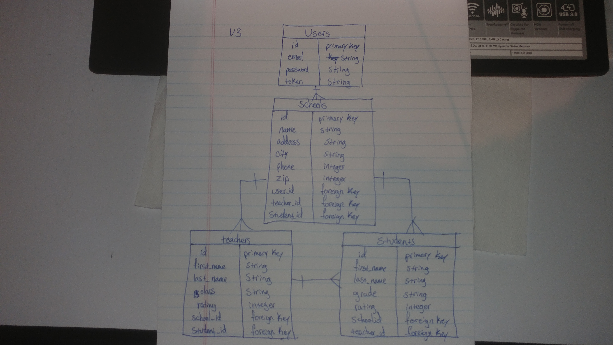

# School Rails Api

School API back end database for School browser.

Technology used in this project include Ruby, Rails, postgreSQL, Heroku and Rake

This API recieves requests from cross-origin clients and responds with JSON snippets of User created school listings.

# School-browser Repo:

https://github.com/jpetrucci49/school-browser

## Live Sites:

https://school-rails-api.herokuapp.com/schools \
https://jpetrucci49.github.io/school-browser

### Unsolved Issues:

Known issues would be things like the total lack of input validation, as well as no display formatting. These are most definitely issues which can be fixed in future itterations. Adding resources for teachers, and students, with a join table named class_rooms for each. School would have many of each, and all would belong_to school.

## ERD:





### Authentication

| Verb   | URI Pattern            | Controller#Action |
|--------|------------------------|-------------------|
| POST   | `/sign-up`             | `users#signup`    |
| POST   | `/sign-in`             | `users#signin`    |
| PATCH  | `/change-password`     | `users#changepw`  |
| DELETE | `/sign-out`        | `users#signout`   |

#### POST /sign-up

Request:

```sh
curl http://localhost:4741/sign-up \
  --include \
  --request POST \
  --header "Content-Type: application/json" \
  --data '{
    "credentials": {
      "email": "'"${EMAIL}"'",
      "password": "'"${PASSWORD}"'",
      "password_confirmation": "'"${PASSWORD}"'"
    }
  }'
```

```sh
EMAIL=ava@bob.com PASSWORD=hannah scripts/sign-up.sh
```

Response:

```md
HTTP/1.1 201 Created
Content-Type: application/json; charset=utf-8

{
  "user": {
    "id": 1,
    "email": "ava@bob.com"
  }
}
```

#### POST /sign-in

Request:

```sh
curl http://localhost:4741/sign-in \
  --include \
  --request POST \
  --header "Content-Type: application/json" \
  --data '{
    "credentials": {
      "email": "'"${EMAIL}"'",
      "password": "'"${PASSWORD}"'"
    }
  }'
```

```sh
EMAIL=ava@bob.com PASSWORD=hannah scripts/sign-in.sh
```

Response:

```md
HTTP/1.1 200 OK
Content-Type: application/json; charset=utf-8

{
  "user": {
    "id": 1,
    "email": "ava@bob.com",
    "token": "BAhJIiVlZDIwZTMzMzQzODg5NTBmYjZlNjRlZDZlNzYxYzU2ZAY6BkVG--7e7f77f974edcf5e4887b56918f34cd9fe293b9f"
  }
}
```

#### PATCH /change-password

Request:

```sh
curl --include --request PATCH "http://localhost:4741/change-password" \
  --header "Authorization: Token token=$TOKEN" \
  --header "Content-Type: application/json" \
  --data '{
    "passwords": {
      "old": "'"${OLDPW}"'",
      "new": "'"${NEWPW}"'"
    }
  }'
```

```sh
OLDPW='hannah' NEWPW='elle' TOKEN='BAhJIiVlZDIwZTMzMzQzODg5NTBmYjZlNjRlZDZlNzYxYzU2ZAY6BkVG--7e7f77f974edcf5e4887b56918f34cd9fe293b9f' sh scripts/change-password.sh
```

Response:

```md
HTTP/1.1 204 No Content
```

#### DELETE /sign-out

Request:

```sh
curl http://localhost:4741/sign-out \
  --include \
  --request DELETE \
  --header "Authorization: Token token=$TOKEN"
```

```sh
TOKEN='BAhJIiVlZDIwZTMzMzQzODg5NTBmYjZlNjRlZDZlNzYxYzU2ZAY6BkVG--7e7f77f974edcf5e4887b56918f34cd9fe293b9f' sh scripts/sign-out.sh
```

Response:

```md
HTTP/1.1 204 No Content
```

### Users

| Verb | URI Pattern | Controller#Action |
|------|-------------|-------------------|
| GET  | `/users`    | `users#index`     |
| GET  | `/users/1`  | `users#show`      |
| PATCH| `/users/1`  | `users#update`    |

#### GET /users

Request:

```sh
curl http://localhost:4741/users \
  --include \
  --request GET \
  --header "Authorization: Token token=$TOKEN"
```

```sh
TOKEN=BAhJIiVlZDIwZTMzMzQzODg5NTBmYjZlNjRlZDZlNzYxYzU2ZAY6BkVG--7e7f77f974edcf5e4887b56918f34cd9fe293b9f scripts/users.sh
```

Response:

```md
HTTP/1.1 200 OK
Content-Type: application/json; charset=utf-8

{
  "users": [
    {
      "id": 2,
      "email": "bob@ava.com"
    },
    {
      "id": 1,
      "email": "ava@bob.com"
    }
  ]
}
```

#### GET /users/:id

Request:

```sh
curl --include --request GET http://localhost:4741/users/$ID \
  --header "Authorization: Token token=$TOKEN"
```

```sh
ID=2 TOKEN=BAhJIiVlZDIwZTMzMzQzODg5NTBmYjZlNjRlZDZlNzYxYzU2ZAY6BkVG--7e7f77f974edcf5e4887b56918f34cd9fe293b9f scripts/user.sh
```

Response:

```md
HTTP/1.1 200 OK
Content-Type: application/json; charset=utf-8

{
  "user": {
    "id": 2,
    "email": "bob@ava.com"
  }
}
```

#### PATCH /users/:id

Request:

```sh
curl "http://localhost:4741/users/${ID}" \
  --include \
  --request PATCH \
  --header "Authorization: Token token=${TOKEN}" \
  --header "Content-Type: application/json" \
  --data '{
    "user": {
      "email": "'"${EMAIL}"'"
    }
  }'
```

```sh
ID=1 TOKEN="BAhJIiU1NGNlYjRmMjBhM2NkZTZiNzk1MGNiYmZiYWMyY2U4MwY6BkVG--ddb1e16af0e05921aa56d771e4a2f816f2a1d46e"
EMAIL=mike@m
sh scripts/users/user-update.sh
```

Response:

```md
HTTP/1.1 200 OK
Content-Type: application/json; charset=utf-8

{"user":{"id":1,"email":"mike@m"}}
```

#### CREATE /schools

Request:

```sh
curl "https://school-rails-api.herokuapp.com/schools" \
  --include \
  --request POST \
  --header "Authorization: Token token=${TOKEN}" \
  --header "Content-Type: application/json" \
  --data '{
    "school": {
      "name": "'"${NAME}"'",
      "address": "'"${ADD}"'",
      "city": "'"${CITY}"'",
      "phone": "'"${PHONE}"'",
      "zip": "'"${ZIP}"'"
    }
  }'
```

```sh
TOKEN="BAhJIiU1NGNlYjRmMjBhM2NkZTZiNzk1MGNiYmZiYWMyY2U4MwY6BkVG--ddb1e16af0e05921aa56d771e4a2f816f2a1d46e"
NAME="English High School"
ADD="300 West St."
CITY=Boston
PHONE=5559054354
ZIP=02020
sh scripts/schools/create.sh
```

Response:

```md
HTTP/1.1 201 Created
Location: https://school-rails-api.herokuapp.com/schools/1
Content-Type: application/json; charset=utf-8

{"school":{"id":1,"name":"English High School","address":"300 West St.","city":"Boston","phone":5559054354,"zip":02020,"user":{"id":1,"email":"User@user"},"editable":true}}
```

#### UPDATE /schools/:id

Request:

```sh
curl "https://school-rails-api.herokuapp.com/schools/${ID}" \
  --include \
  --request PATCH \
  --header "Authorization: Token token=${TOKEN}" \
  --header "Content-Type: application/json" \
  --data '{
    "school": {
      "name": "'"${NAME}"'",
      "address": "'"${ADD}"'",
      "city": "'"${CITY}"'",
      "phone": "'"${PHONE}"'",
      "zip": "'"${ZIP}"'"
    }
  }'
```

```sh
ID=1
TOKEN="BAhJIiU1NGNlYjRmMjBhM2NkZTZiNzk1MGNiYmZiYWMyY2U4MwY6BkVG--ddb1e16af0e05921aa56d771e4a2f816f2a1d46e"
NAME="Cambridge College"
ADD="300 West St."
CITY=Boston
PHONE=2203043030
ZIP=02020
sh scripts/schools/update.sh
```

Response:

```md
HTTP/1.1 200 OK
Content-Type: application/json; charset=utf-8

{"school":{"id":1,"name":"Cambridge College","address":"300 West St.","city":"Boston","phone":2203043030,"zip":02020,"user":{"id":1,"email":"User@user"},"editable":true}}
```

#### INDEX /schools

Request:

```sh
curl "https://school-rails-api.herokuapp.com/schools" \
  --include \
  --request GET \
  --header "Authorization: Token token=${TOKEN}" \
  --header "Content-Type: application/json" \
```

```sh
TOKEN="BAhJIiU1NGNlYjRmMjBhM2NkZTZiNzk1MGNiYmZiYWMyY2U4MwY6BkVG--ddb1e16af0e05921aa56d771e4a2f816f2a1d46e"
sh scripts/schools/index.sh
```

Response:

```md
HTTP/1.1 200 OK
Content-Type: application/json; charset=utf-8

{"school":{"id":1,"name":"Cambridge College","address":"300 West St.","city":"Boston","phone":2203043030,"zip":02020,"user":{"id":1,"email":"User@user"},"editable":true}}
```

#### SHOW /schools/:id

Request:

```sh
curl "https://school-rails-api.herokuapp.com/schools/${ID}" \
  --include \
  --request GET \
  --header "Authorization: Token token=${TOKEN}" \
  --header "Content-Type: application/json" \
```

```sh
ID=1
TOKEN="BAhJIiU1NGNlYjRmMjBhM2NkZTZiNzk1MGNiYmZiYWMyY2U4MwY6BkVG--ddb1e16af0e05921aa56d771e4a2f816f2a1d46e" sh scripts/schools/show.sh
```

Response:

```md
HTTP/1.1 200 OK
Content-Type: application/json; charset=utf-8

{"school":{"id":1,"name":"Cambridge College","address":"300 West St.","city":"Boston","phone":2203043030,"zip":02020,"user":{"id":1,"email":"User@user"},"editable":true}}
```

#### DELETE /schools/:id

Request:

```sh
curl "https://school-rails-api.herokuapp.com/schools/${ID}" \
  --include \
  --request DELETE \
  --header "Authorization: Token token=${TOKEN}" \
  --header "Content-Type: application/json" \
```

```sh
ID=1
TOKEN="BAhJIiU1NGNlYjRmMjBhM2NkZTZiNzk1MGNiYmZiYWMyY2U4MwY6BkVG--ddb1e16af0e05921aa56d771e4a2f816f2a1d46e" sh scripts/schools/delete.sh
```

Response:

```md
HTTP/1.1 204 No Content
Content-Length: 0
```

## [License](LICENSE)

1.  All content is licensed under a CC­BY­NC­SA 4.0 license.
1.  All software code is licensed under GNU GPLv3. For commercial use or
    alternative licensing, please contact legal@ga.co.
